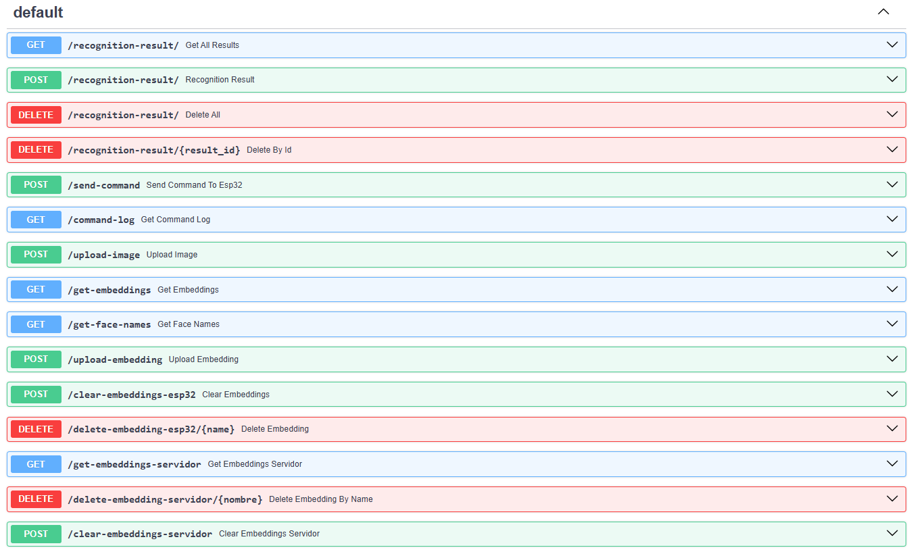
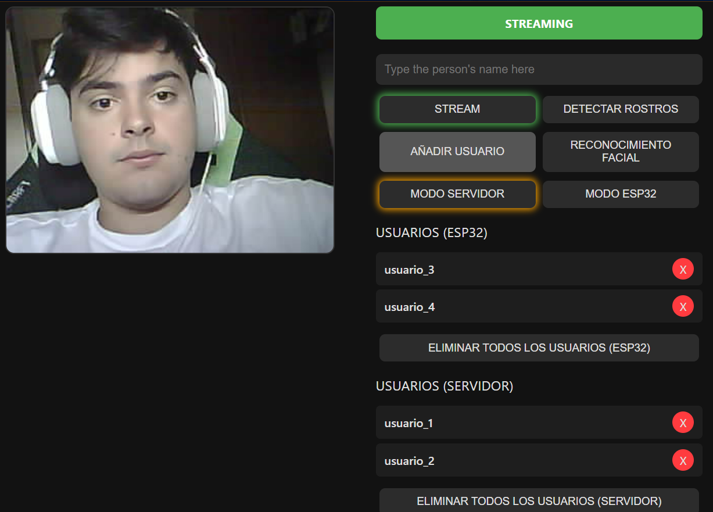
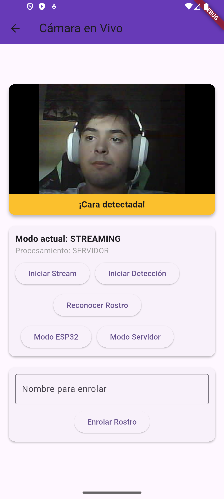
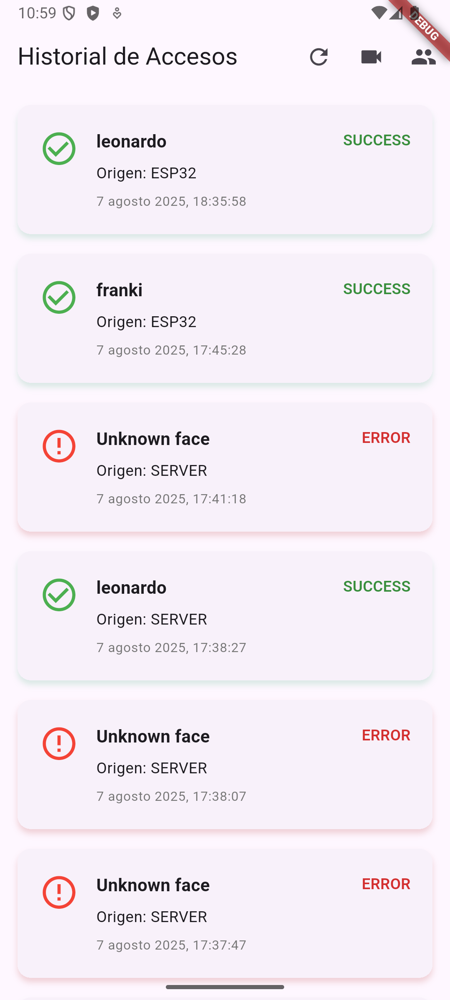
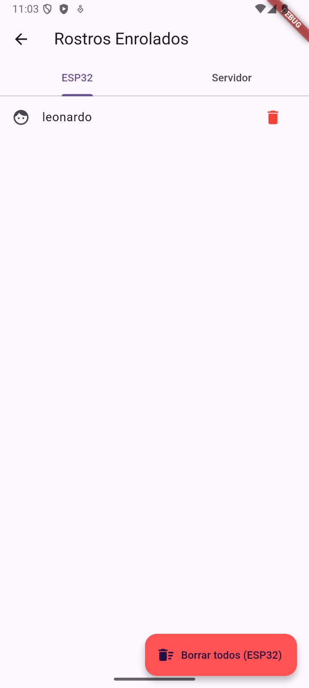

# Sistema de Control de Acceso Facial – Proyecto TFG

Proyecto de **control de acceso mediante reconocimiento facial** con:
- **ESP32-CAM** → Captura y procesamiento de imágenes (local o servidor).
- **FastAPI (Python)** → Backend con gestión de embeddings, base de datos y WebSocket.
- **Flutter** → Interfaz para visualizar accesos, controlar modos y gestionar rostros.

---
### 📂 Estructura del Proyecto
#### 🔹 `version_1_interfaz_web/`
- **`esp32cam_v1/reconocimiento_en_esp32`** → Firmware ESP32-CAM con página web (`camera_index.h`).  
- **`servidor_v1/`** → Backend FastAPI para gestión de embeddings y resultados.  
- **`flutter_v1/`** → Aplicación Flutter para consultar el historial de accesos.  

#### 🔹 `version_2_interfaz_movil/`
- **`esp32cam_v2/reconocimiento_en_esp32`** → Firmware ESP32-CAM con comunicación **WebSocket/HTTP hacia FastAPI**.  
- **`servidor_v2/`** → Backend FastAPI con soporte para WebSockets y control desde app móvil.  
- **`flutter_v2/`** → Aplicación Flutter más completa (historial, video en vivo, gestión de rostros enrolados).  

---

## API FastAPI

### Endpoints principales

La API FastAPI gestiona todo el flujo de información entre los módulos.  
Incluye funcionalidades como:
- Registro y consulta de accesos.  
- Gestión de embeddings (ESP32 y servidor).  
- Envío de comandos y recepción de logs del ESP32.  
- Procesamiento de imágenes y reconocimiento facial.

---

## Interfaz Web

La interfaz web permite alternar entre modo local (procesamiento en el ESP32-CAM) y remoto (servidor), activar la detección de rostros, realizar reconocimiento facial comparando con usuarios registrados, añadir nuevos usuarios con sus embeddings, y consultar o eliminar usuarios de forma individual o total de los usuarios.

---

## Aplicación Móvil (Flutter)

<table>
  <tr>
    <td></td>
    <td></td>
    <td></td>
  </tr>
</table>

La aplicación móvil, desarrollada en **Flutter**, permite:
- Visualizar la cámara en tiempo real.  
- Consultar registros de acceso.  
- Enrolar o eliminar rostros.  
- Alternar entre el modo local (ESP32) y remoto (servidor).

---

## Archivos más relevantes

### Servidor 
- **`main.py`** → Servidor FastAPI.  
  - Gestión de embeddings (servidor y ESP32).  
  - Procesamiento con InsightFace.  
  - WebSocket para streaming de video y mensajes.  
  - Base de datos SQLite para registrar accesos.  
- **`accesos.db`** → Base de datos con registros de accesos.  
- **`face_db.pkl`** → Embeddings almacenados en modo servidor.  
- **`face_db_esp32.pkl`** → Embeddings almacenados en modo ESP32.  

---

### ESP32
- **`reconocimiento_en_esp32.ino`** → Firmware ESP32-CAM.  
  - Incluye **dos variantes**:  
    - **Versión Interfaz Web** → Con servidor HTTP en el ESP32 y página embebida (`camera_index.h`).  
    - **Versión Interfaz Móvil (Flutter)** → Comunicación vía WebSocket/HTTP con FastAPI.  
- **`camera_index.h`** → Página web embebida en la versión web.  
- **`camera_pins.h`** → Configuración de pines del ESP32-CAM (modelo AI-Thinker u otros).  
- **`HTML_interface/`** → Archivos HTML/CSS/JS de la interfaz web externa para pruebas.  
 

---

### Flutter
- **`main.dart`** → Punto de entrada de la aplicación.  
- **`registro_list.dart`** → Pantalla principal con historial de accesos.  
- **`video_screen.dart`** → Streaming en vivo y control de comandos.  
- **`enrolled_faces_page.dart`** → Lista de rostros enrolados (ESP32 / servidor).  
- **`registro_model.dart`** → Modelo de datos para accesos.  
- **`registro_service.dart`** → Conexión HTTP al backend.  
- **`esp32_socket_service.dart`** → Servicio WebSocket para comunicación en tiempo real.  

---

## Funcionalidades principales

- **ESP32-CAM**
  - Streaming de cámara en MJPEG.  
  - Modos: *stream, detect, recognise, enroll*.  
  - Procesamiento local (ESP32) o externo (servidor FastAPI).  

- **Backend (FastAPI)**
  - Procesamiento facial con InsightFace.  
  - Gestión de embeddings (servidor y ESP32).  
  - Registro de accesos en SQLite.  
  - WebSocket para retransmisión de video y mensajes.  

- **Flutter**
  - Visualización de accesos en tiempo real.  
  - Streaming con estado de reconocimiento.  
  - Enrolamiento de rostros.  
  - Gestión de listas de rostros en ESP32 y servidor.  

---

## Documentación del proyecto

- [Memoria del Trabajo Fin de Grado (PDF)](./docs/Memoria_TFG.pdf)  
  Contiene el diseño, desarrollo, pruebas y resultados del sistema.

- [Manual de Usuario (PDF)](./docs/Manual_Usuario.pdf)  
  Explica paso a paso la instalación, configuración y uso del sistema.

## Autor

**Francisco** – Proyecto Fin de Grado en Ingeniería.

---
